<div aling="center">

</div>

---
<div align="center">
  <strong>
  Aplicativo do Concurso "Masters of frontend" da IBM
  </strong>

  <p align="center">
    <a href="#sobre">Sobre</a>&nbsp;&nbsp;&nbsp;&#149;&nbsp;&nbsp;&nbsp;
    <a href="#estrutura-de-pastas">Estrutura de pastas</a>&nbsp;&nbsp;&nbsp;&#149;&nbsp;&nbsp;&nbsp;
    <a href="#instalação">Instalação</a>&nbsp;&nbsp;&nbsp;&#149;&nbsp;&nbsp;&nbsp;
    <a href="#observações">Observações</a>&nbsp;&nbsp;&nbsp;&#149;&nbsp;&nbsp;&nbsp;
    <a href="#tecnologias-utilizadas">Tecnologias Utilizadas</a>&nbsp;&nbsp;&nbsp;&#149;&nbsp;&nbsp;&nbsp;
    <a href="#screenshots">Screenshots</a>&nbsp;&nbsp;&nbsp;&#149;&nbsp;&nbsp;&nbsp;
   </p>
</div>

---

<div align="center">
  
  
</div>

# Sobre

Este é um projeto simplificado que oferece aos usuários a capacidade de realizar login na aplicação, explorar anúncios de carros, visualizar detalhes específicos dos veículos e criar seus próprios anúncios.

# Estrutura de pastas

```bash
├── src                                    # Contém código fonte do projeto
│   ├── styles                             # Configuração de estilos globais  
│   ├── screens
│   │   ├── CarDetails                     #  Tela de detalhes dos carros.
│   │   │   └── SlideIndicator             #  Abstração do componente de indicador do slide de carros.
│   │   ├── Cars                           #  Tela que lista todos os anúncios.
│   │   │   └── CarList                    #  Abstração da lista de carros.
│   │   ├── CreateAuction                  #  Tela de Criação de um novo anúncio
│   │   └── Login                          #  Tela de Login no aplicativo
│   ├── services
│   │   └── Cars.tsx                       #  Service fake para recuperar os carros da API
│   ├── hooks
│   │   └── useAuth.tsx                    #  Estado que define se o usuário está ou não Loggado
│   ├── components                         #  Componentes reutilizaveis da aplicação
│   ├── models                             
│   │   └── Cars.ts                        #  Tipos do objeto carro para validações em outros componentes
│   ├── schemas                            #  Schemas de validações dos formulários
│   └── index.tsx
|
...
├── Docs                                   # Materiais da documentação
├── assets                                 # Assets da aplicação
....
```

# Instalação

```bash
npm install
npm run android
npm start
```

# Observações

Embora o aplicativo tenha sido desenvolvido em React Native, sua compatibilidade, por enquanto, está restrita ao sistema Android. Infelizmente, não tenho um MacBook disponível no momento para corrigir problemas específicos relacionados à plataforma iOS.

# Tecnologias utilizadas

- React Native (Framework Principal)
- Styled-components (Utilizado para estilização)
- React-hook-form e Zod (Gerenciamento de formulários e validações)
- Typescript (Programação com tipos)
- Zustand (Gerenciamento de estados da aplicação)

# Screenshots

## Login com validação de schema

<h1 align="center">
    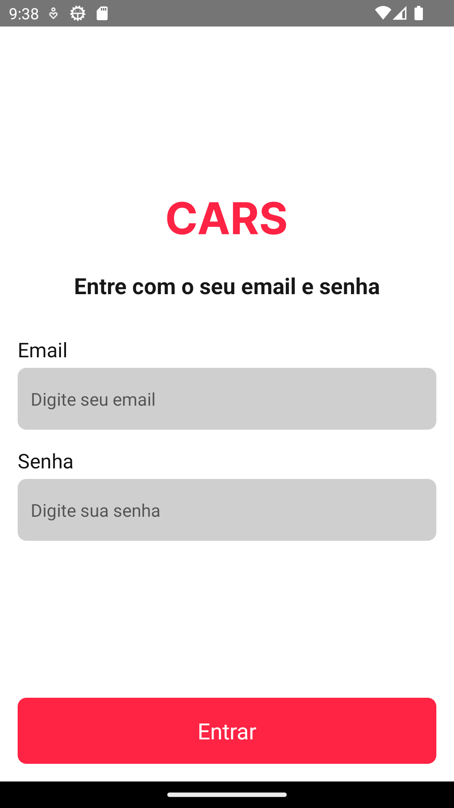
    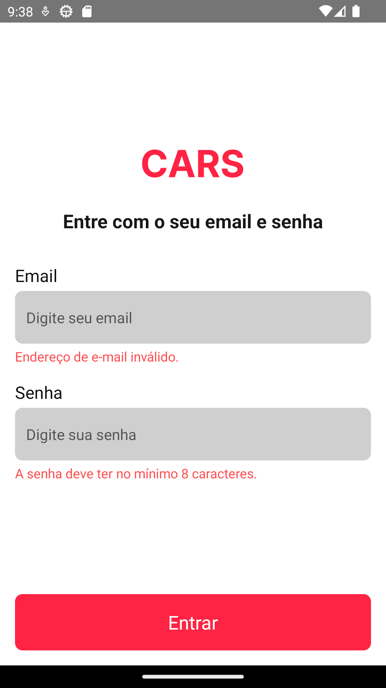
</h1>

## Lista de carros com filtro por nome, marca ou modelo

<h1 align="center">
    
    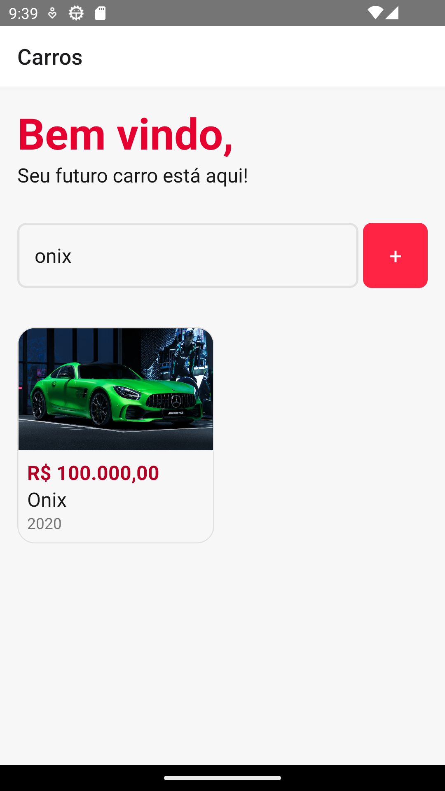
</h1>

## Visualizar carro específico e notificar o vendedor

<h1 align="center">
    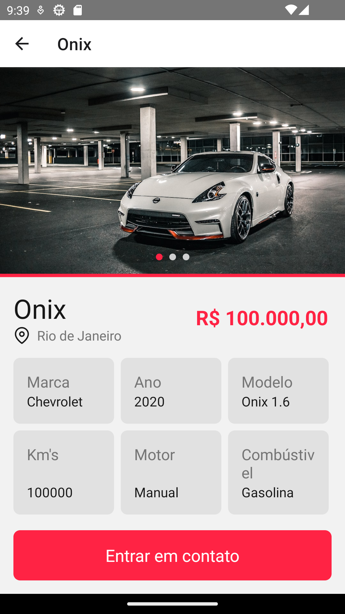
    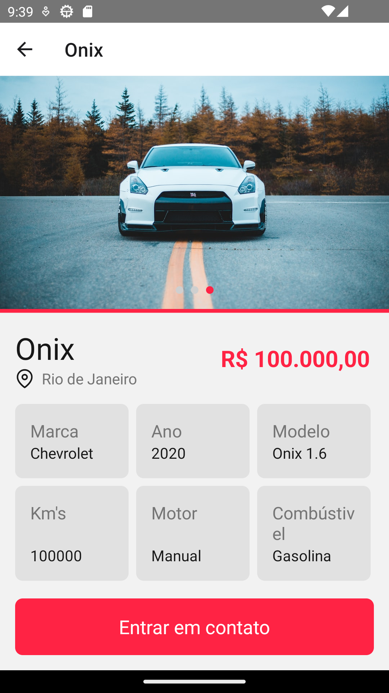
    
</h1>

## Criar novo Anúncio

<h1 align="center">
    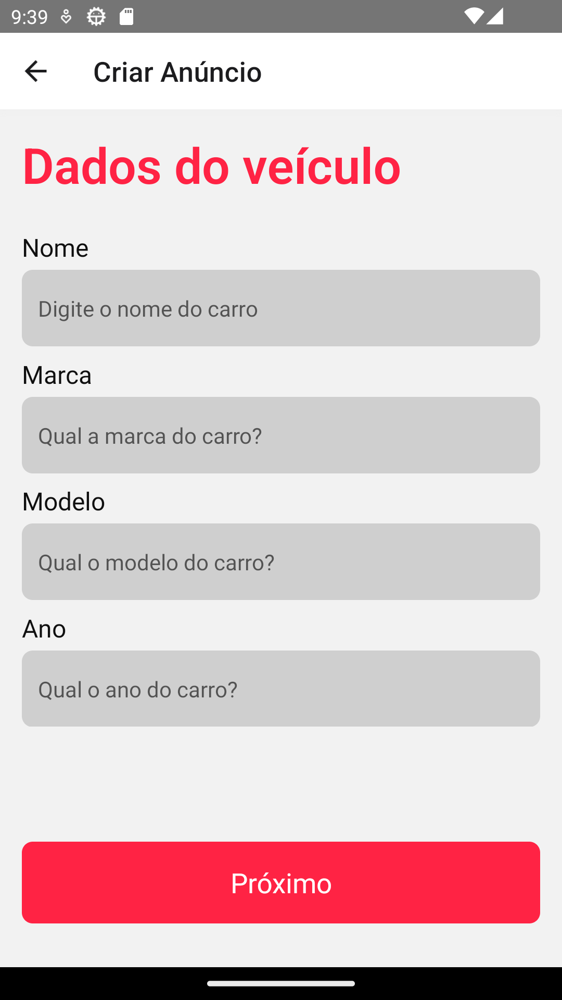
    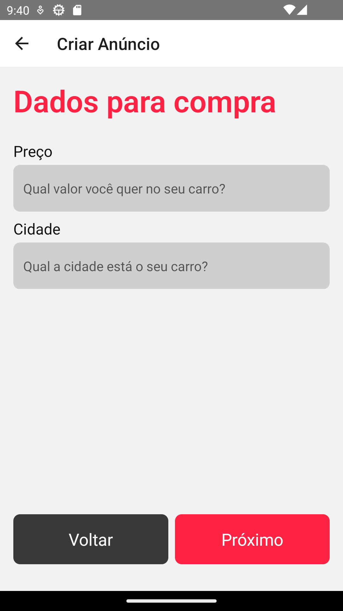
    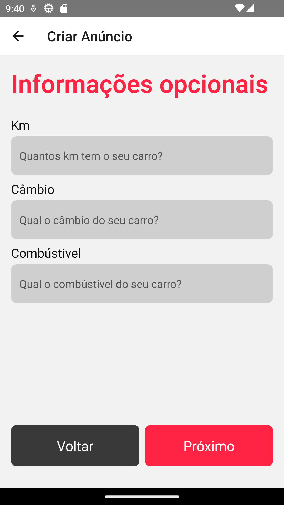
    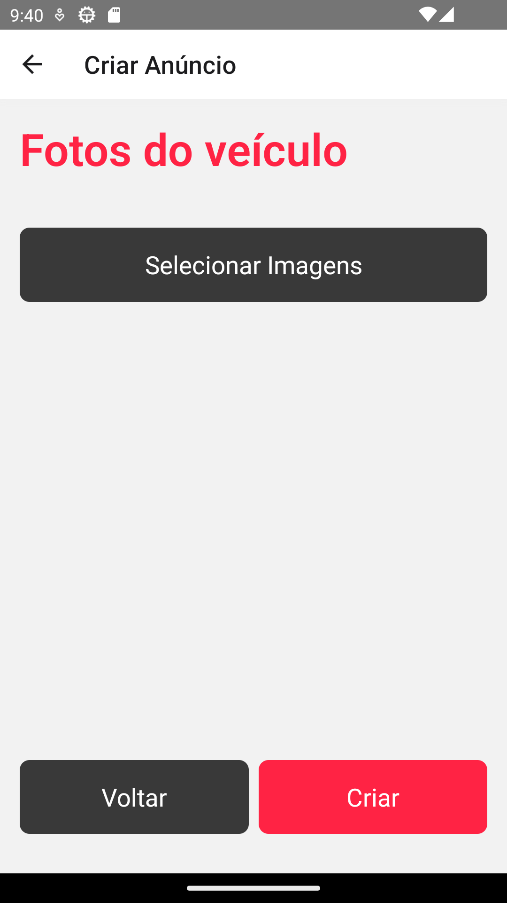
</h1>

## Criar novo anúncio com erro no schema

<h1 align="center">
    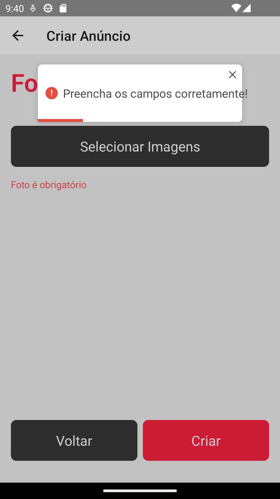
    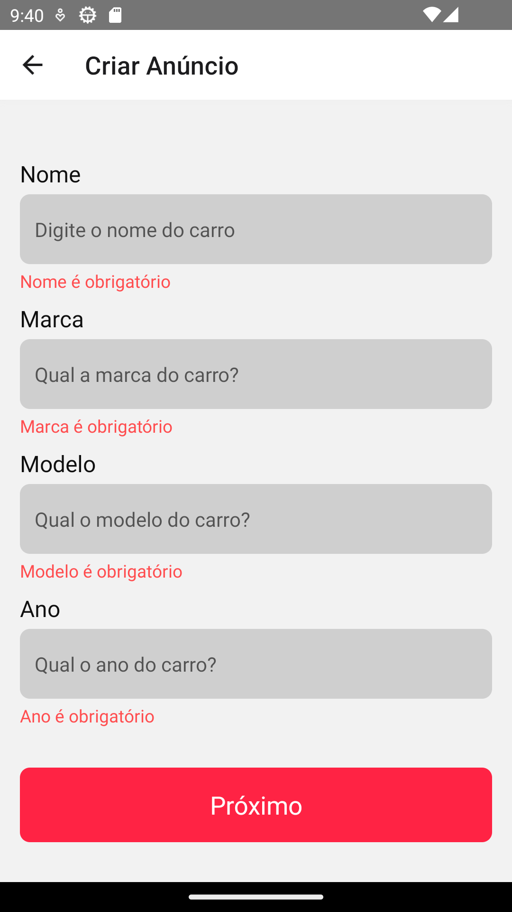
    
    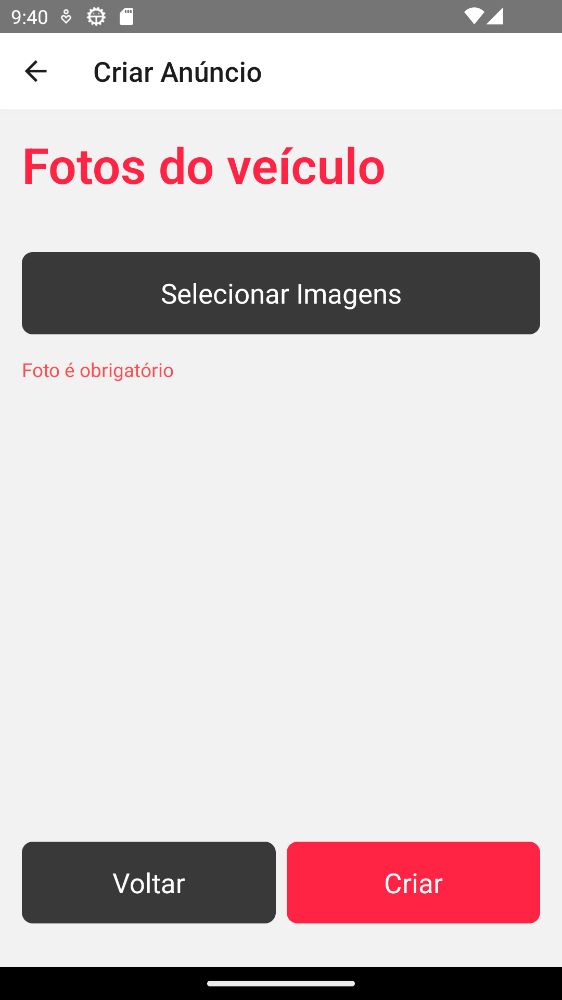
</h1>

## Adicionando foto e validando

<h1 align="center">
    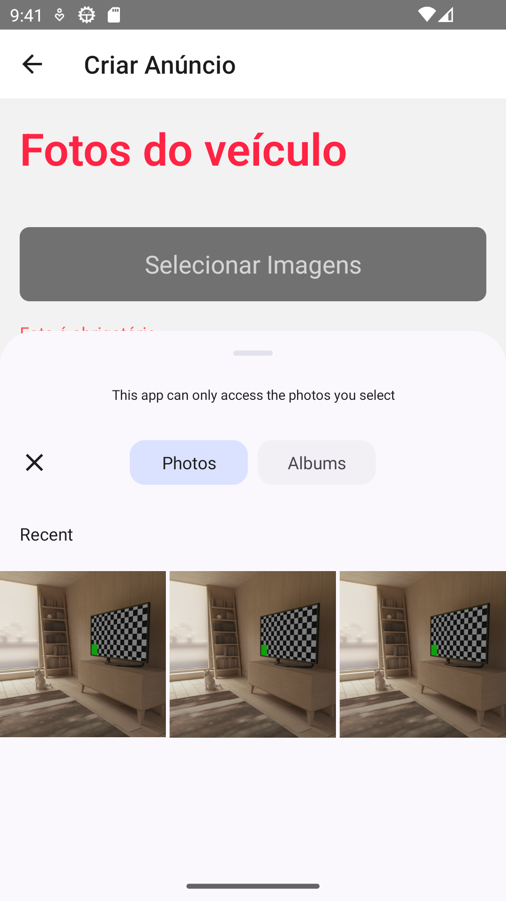
    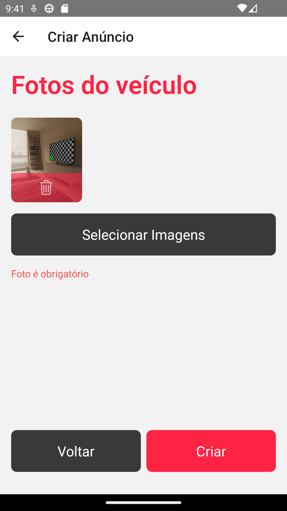
    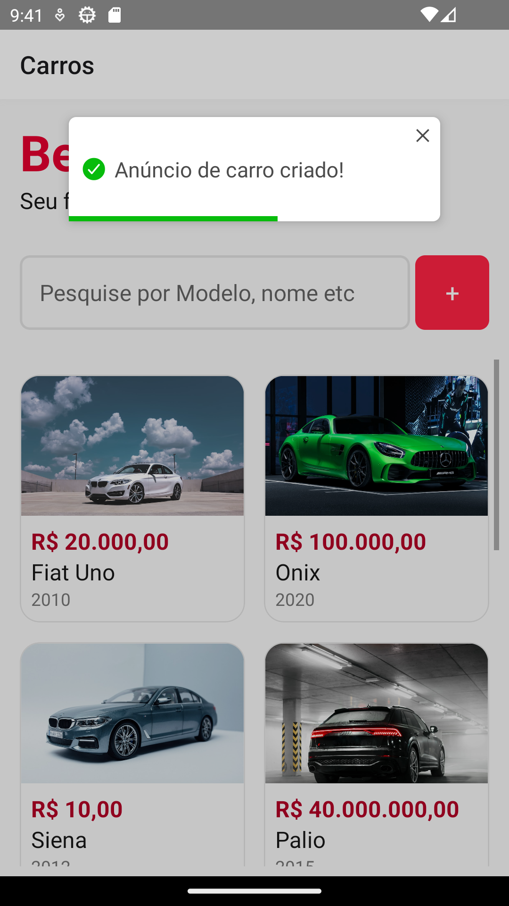
</h1>